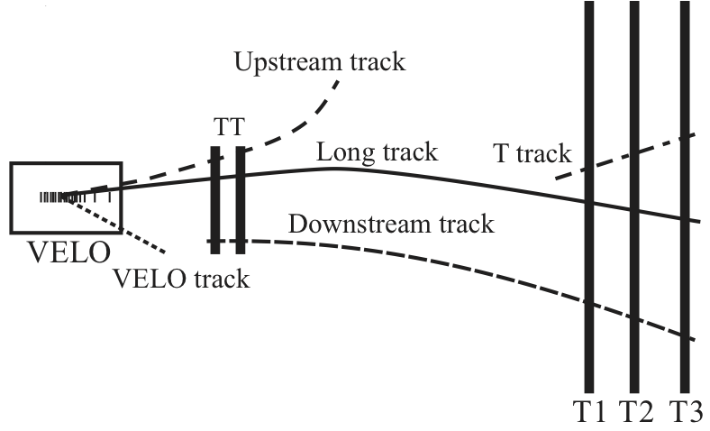
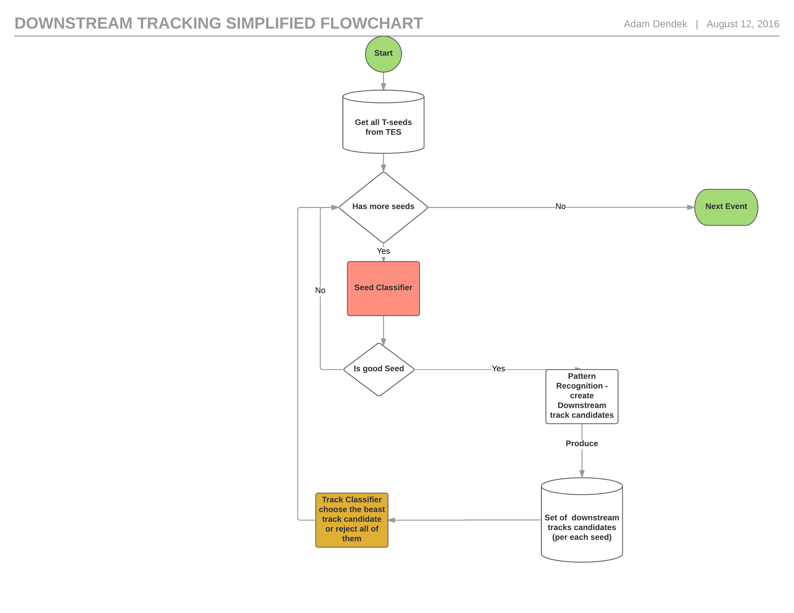

# LHCb Downstream Tracking study  
This repository contains the source code for the studies to improve the LHCb Downstream Tracking algorithm.  

## Problem description

I am working on improvement of the performance, interpreted as reduction of the ghost track rate, of the **Downstream Tracking** algorithm.  
The downstream algorithm is seeded by tracks that are reconstructed in the T. 
These T seeds are combined with hits in the TT to make downstream candidates. By default, the algorithm uses all T seeds and TT hits.
The schematic view of the LHCb detector with types of track is attached below. 


The most important part of this study, apart from classifier performance is <font color='red'>classifier evaluation time</font>. 
Each of these models runs in **LHCb High Level Trigger 2** [HLT2](http://cerncourier.com/cws/article/cern/62495) so I cannot afford any lose on speed and the chosen model must be implemented in C++. The source code of this algorithm, as well as a place to implement the final model can be found in the directory **BrunelCode**. This code is "forked" from the [CERN's gitlab repository](https://gitlab.cern.ch/lhcb/Rec/tree/master).    


The directory **SeedClassifier** contains notebooks documented study on the first of the classifiers - Seed classifier, depicted in red on above flowchart.  
The another directory - **TrackClassifier** contains study of the second, final classifier. 

###The first classifier can be treated as a <font color='red'>spam mail </font> detector-like problem. 

This means that we don't want to lose any positive signal (good downstream tracks). In the same time the goal is to reduce as much as possible, perfect case all of ghost seeds. It need to works all of the mail spam detectors. If we loose good mail e.g. acceptance for internship by the company XYZ is a serious problem. On the other hand if we accept such mail as *free holiday advert* it is not so painful for our user. 

###To choose the best model I will train and tune various of available Machine Learning models. I will focus on: 
 1. [Baseline kNN](SeedClasifier/Baseline.ipynb). Just to get some intuition about datasets and classification score. 
 2. [Boosted Decision Trees](SeedClasifier/Baseline-BDT.ipynb) (BDT) based on sklearn GradientBoostedClassifier. 
 3. [BDT](SeedClasifier/BDT-XGBoost.ipynb) based on xgboost library 
  * <span style="color:red;">This is the most important model.</span> It has the best performance measured as area under ROC curve. 
  * I also focused on improvement of the classifier evaluation timing. I implement idea of [bonsai Boosted Decision Trees(bBDT)](http://arxiv.org/abs/1210.6861). The concept of bBDT is to transfer the  base classifier (BDT) into lookup table. In this case the classifier evaluation time is ~ O(1)! 
 4. Linear model - [Logistic Regression](SeedClasifier/LogisticRegression.ipynb)
 5. [Deep Neural Network](SeedClasifier/DNN.ipynb) based on Lasagne and Theano
 6. [Deep Neural Network]((SeedClasifier/DNN-Keras.ipynb)) based on Keras and Theano

#Installation python Machine Learning part of the project
To setup the ML part of the  downstream tracking study you need to:  
* Log to the remote computing cluster e.g, lxplus  
 * ``` ssh -L 7000:localhost:6000 username@lxplus.cern.ch ``` 
* Clone the repository   
 * ``` git clone https://github.com/adendek/DownstreamTracking.git  ```
* install all python packages    
  * ``` pip install --user --upgrade -r requirements.txt ``` 
* start the jupyter notebook
  * ``` jupyter notebook --no-browser --port=6000```  
